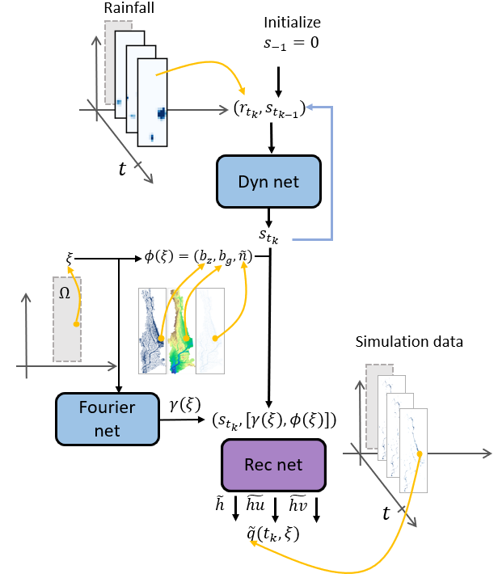
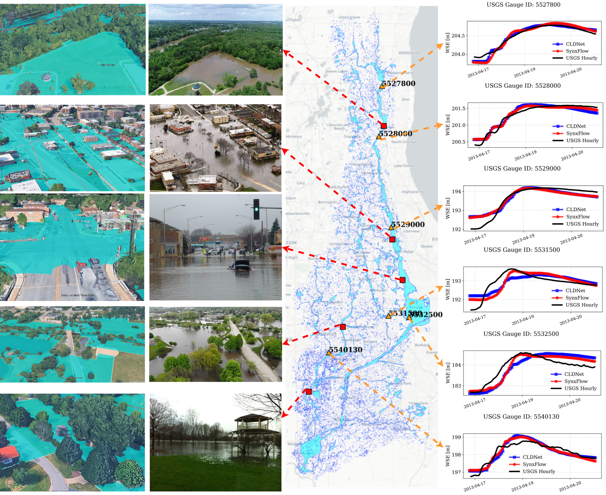

# CLDNet: a conditional latent dynamics network for metropolitan flood forecasting

Code, input data and trained models for

> P. Si, Y. Qiu, O. Sallam, J. Feinstein, Z. He, E. Yan, P. Chen (2026). *Toward AI-driven digital twins for
> metropolitan floods: A conditional latent dynamics network surrogate of the shallow water equations.*
> Journal of Hydrology 680, 136461. https://doi.org/10.1016/j.jhydrol.2026.136461 ([arXiv:2605.13761](https://arxiv.org/abs/2605.13761))

CLDNet is a fast surrogate of the 2D shallow water equations. A low-dimensional latent state evolves in time,
driven by rainfall, and a coordinate-based decoder conditioned on terrain (elevation, slope, Manning roughness) reconstructs
water depth and unit discharges at any query point. On the Des Plaines River basin (HUC8 07120004, greater Chicago;
4.2 million active cells at 30 m) it produces a 96-hour basin-wide forecast in about 29 s on one GPU, ~115× faster
than the SynxFlow simulator it is trained on.

<p align="center"></p>

*CLDNet. Rainfall r and the previous latent state drive the dynamics network (Dyn net); the reconstruction network (Rec net)
decodes the latent state together with a Fourier embedding γ(ξ) of the query coordinate and terrain features φ(ξ)
into water depth h and unit discharges hu, hv.*

## Validation against USGS gauges (April 2013)



*April 2013 flood-of-record. Left: simulated inundation over aerial imagery, next to photographs of the same flooded reaches; centre: the basin with NHDPlus flowlines and USGS gauges; right: water-surface elevation from SynxFlow (red), CLDNet (blue) and USGS gauges (black). Photographs: Illinois Association for Floodplain and Stormwater Management; C. Walker, Chicago Tribune; National Weather Service Chicago; NOAA National Water Prediction Service; National Weather Service (Facebook). Basemap © OpenStreetMap contributors, © CARTO.*

## What is in this repository

| Folder | Contents |
|---|---|
| `code/ldnet/` | LDNet/CLDNet model, training, inference and evaluation; LD-EnSF data assimilation |
| `code/fno/` | FNO baseline for the Texas benchmark: training and autoregressive inference |
| `configs/` | architecture, checkpoint and inference settings for each model and dataset |
| `checkpoints/` | trained CLDNet and LDNet (Des Plaines and Texas) and FNO (Texas) |
| `splits/illinois_split.json` | 90 training storms, 3 held-out test storms, and the separately held-out 2013 event |
| `data/static/` | Des Plaines DEM (EPSG:5070), NLCD land cover, gauge positions, shared initial condition |
| `data/forcings/` | Stage IV hourly rainfall for all 94 Des Plaines storms (`.nc` simulator input, `rain_source.npy` model input) |
| `data/illinois_grid/` | the 1,408,587 evaluation cells with their coordinates and terrain features, for inference |
| `data/usgs_2013_validation/` | USGS stage and discharge records for the April 2013 flood-of-record |
| `data/texas/` | Texas benchmark inputs: DEM and the 120 hyetographs |
| `preprocessing/` | DEM and land-cover preparation, Stage IV processing, SynxFlow simulation scripts, USGS validation |
| `scripts/` | inference from the repository inputs, and scripts that reproduce the paper's numbers and Fig. 7b |

Each data folder has a README and a `SHA256SUMS` file (`sha256sum -c SHA256SUMS`).

**Not included: the simulated flow fields.** They are too large for GitHub (about 1.8 TB for the 94 full-grid
Des Plaines runs and 65 GB for Texas). The Des Plaines runs can be regenerated from the inputs here with the scripts in
`preprocessing/simulation/` and the open-source [SynxFlow](https://github.com/SynxFlow/SynxFlow) solver, about 55 min per
storm on an NVIDIA L40S.

## Quick start

Python ≥ 3.11 with a CUDA GPU (CPU works for inference, slowly).

```bash
git clone https://github.com/Flood-Digital-Twins/CLDNet.git && cd CLDNet
pip install -r requirements.txt
```

**Forecast any storm with the released model.** No simulation data are needed:

```bash
python scripts/predict_cldnet.py --storm 107                      # held-out test storm
python scripts/predict_cldnet.py --storm 2013-04-17_2013-04-21   # the April 2013 flood-of-record
python scripts/predict_cldnet.py --storm 107 --model ldnet        # the LDNet baseline (no terrain conditioning)
```

This writes a peak-depth map and `outputs/<model>_<storm>.npz` (peak depth per cell; add `--save-fields` for all 96 hourly
fields of h, hu, hv). Storm ids are the folder names in `data/forcings/`.

**Regenerate the reference simulations** (requires SynxFlow and a GPU; see `preprocessing/simulation/README.md`):

```bash
pip install -r requirements-preprocessing.txt
python preprocessing/simulation/run_hipims_event.py      --event_idx 107
python preprocessing/simulation/collect_training_data.py --event_idx 107    # -> data/sims_30/event_107_.../flow_variables.npy
```

**Model-ready arrays.** Training and the evaluation scripts read `data/postprocessed/illinois/` with one set of files
per storm `k`: `flow_variables_traj<k>.npy` is the full-grid `flow_variables.npy` at hours 1–96 restricted to the
`aggregate_mask` cells of `data/illinois_grid/grid.npz` (row-major order), shape `(1, 96, 1408587, 3)`, float16;
`rain_source_traj<k>.npy` is rows 0–95 of `data/forcings/event_<k>/rain_source.npy`, shape `(1, 96, 507)`;
`coords_traj<k>.npy` and `static_features_traj<k>.npy` are the grid's `coords` and `static_features`. The 2013 event
is `k = 120`.

**Train** (settings in `configs/*/illinois.json`; Slurm example in `configs/illinois_h200.sbatch`):

```bash
torchrun --nproc_per_node=8 code/ldnet/ldnet_chicago_efficient.py --ddp --num-trajectories 110 \
  --split-file splits/illinois_split.json \
  --all-vars --num-latent-states 200 --fourier-mapping-size 32 --sample-indices 100000 \
  --use-static-features --static-feature-dim 3 --model-path outputs/training/cldnet_illinois
```

**Reproduce the paper's numbers** from the checkpoints once model-ready arrays exist: `scripts/rescore_checkpoints.py`
(Illinois tables), `scripts/rescore_texas.py` (Texas), `scripts/score_train_vs_heldout.py` and `scripts/plot_fig7b.py` (Fig. 7b).
The Texas FNO baseline has its own environment and instructions in `code/fno/README.md` (neuraloperator 1.0.2).

## License

Code and trained models: MIT (`LICENSE`). Data in `data/`: CC BY 4.0 (`data/LICENSE.md`). The data derive from
public-domain US Government sources: USGS 3DEP elevation, NLCD 2021 land cover, NCEP Stage IV precipitation and USGS
NWIS gauge records.

## Citation

```bibtex
@article{si2026cldnet,
  title   = {Toward {AI}-driven digital twins for metropolitan floods: A conditional latent dynamics network
             surrogate of the shallow water equations},
  author  = {Si, Phillip and Qiu, Yuan and Sallam, Omar and Feinstein, Jeremy and He, Ziang and Yan, Eugene and Chen, Peng},
  journal = {Journal of Hydrology},
  volume  = {680},
  pages   = {136461},
  year    = {2026},
  doi     = {10.1016/j.jhydrol.2026.136461}
}
```
